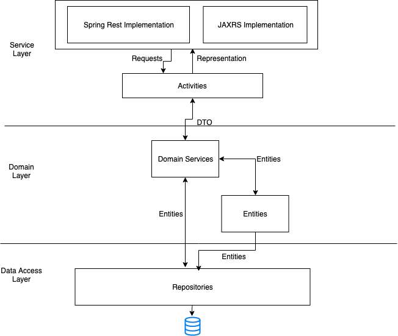

# LUC-COMP433 - Ecommerce project

It is a project which is developed during the Web Services Programming course taught at Loyola University Chicago.

This project is hosted on github.com : [Github.com Repository](https://github.com/uuganbold/comp433-ecommerce)

This project is deployed on the AWS : http://18.220.199.235:8080/ecommerce/   

## Course Assignments
1. You can find a report for Assignment-2 [here](https://github.com/uuganbold/comp433-ecommerce/blob/hw2-domain/docs/class/project2.md)

## Goal 
In this project, we are developing eCommerce system which would connect to the parties concerned through
RESTful web api. 

## Architecture

We are using springframework as an architectural framework and Hibernate as an ORM framework.
This webapp's architecture would be seen like below so far.

The application has two layers:business and persistence (We will more layers soon): Business and Persistence. 

And also it has Entities classes which represent data stored and passed between the layers.

### 1. Entities:

Entities would be seen like below and each of them represents Hibernate Entity.

### 2. Persistence Layer:
In the persistence layer, we are using Spring-Data-Jpa. Each repository object in this layer is responsible for Database-CRUD operations for the entities.
* AddressRepository
* CategoryRepository
* CustomerRepository
* OrderRepository
* PaymentRepository
* ProductRepository
* ReviewRepository
* SellerRepository

### 3. Business Layer:
Objects in this layer are responsible for providing business logic for the system.
1. CategoryService - 
    * addCategory(Category)
    * removeCategory(Long id) 

2. CustomerService
    * void addCustomer(Customer customer);
    * void removeCustomer(Long id);
    * void updateCustomer(Customer customer);
    * void addPaymentOption(Customer customer, Payment payment);
    * void removePaymentOption(Customer customer, Long id);
    * void addAddress(Customer customer, Address address);
    * void removeAddress(Customer customer, Long id);
    * Payment getDefaultPayment(Customer customer);
    * Address getDefaultAddress(Customer customer);
    * void makeOrder(Customer customer, Cart cart, Payment payment, Address address) 

3. OrderService
    * void createOrder(Order order) throws QuantityNotSufficientException;
    * void updateStatus(Long id, OrderStatus status);
    *void cancelOrder(Long id);

4. ProductService
    * List<Product> search(String query);
    * Long checkAvailabiliy(Long id);
    * void addProduct(Product product);
    * void updateProduct(Product product);

5. ReviewService
    * void addReview(Review review);

6. SellerService
    * void addSeller(Seller seller);
    * void removeSeller(Long id);
    * void addProduct(Seller seller, Product product);
    * void notifySales(Seller seller, OrderItem item);

## Development

1. We are using Visual Paradigm Community Edition as UML Modeling tool. You can download the tool from the link
[https://www.visual-paradigm.com/editions/community/](https://www.visual-paradigm.com/editions/community/)

2. We are using Springframework as Architectural Framework.

3. We are using Hibernate as ORM framework
